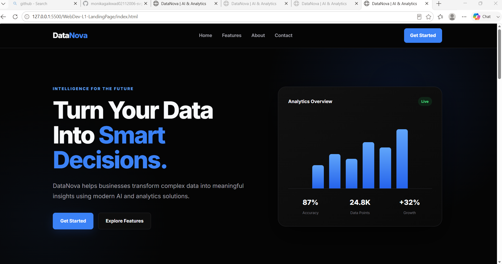

# DataNova – AI & Analytics Landing Page

## Project Overview

DataNova is a modern and responsive landing page designed for an AI and Data Analytics platform.

The project focuses on creating a clean, professional, and user-friendly interface using only HTML5 and CSS3.

This project was developed as part of the **Oasis Infobyte Web Development Internship – Level 1, Task 1**.

## Features

* Sticky navigation bar
* Responsive design
* Hero section with call-to-action buttons
* Features section
* About section
* Customer testimonials
* Call-to-action section
* Footer with contact and social links
* Mobile-friendly layout
* Clean and modern UI
* CSS Flexbox and Grid layout
* No JavaScript required

## Technologies Used

* HTML5
* CSS3
* CSS Flexbox
* CSS Grid
* Google Fonts
* Responsive Web Design

## Project Structure

```text
WebDev-L1-LandingPage/
│
├── index.html
├── style.css
├── README.md
│
└── screenshots/
    └── landing-page.png
```

## How to Run the Project

1. Download or clone this repository.
2. Open the `WebDev-L1-LandingPage` folder.
3. Open `index.html` in any modern web browser.

Alternatively, the project can be opened using the **Live Server** extension in Visual Studio Code.

## Responsive Design

The landing page is designed to work properly on:

* Desktop
* Laptop
* Tablet
* Mobile devices

CSS media queries are used to adjust the layout for smaller screen sizes.

## Screenshots

### Landing Page



## Project Links

### Live Demo

[View Live Demo]https://oibsip-5eep.vercel.app/

### GitHub Repository

[View Source Code on GitHub]https://github.com/monikagaikwad02112006-svg/OIBSIP


## Internship Task

**Organization:** Oasis Infobyte
**Track:** Web Development
**Level:** Level 1
**Task:** Landing Page

## Author

**Monika Gaikwad**

## License

This project was created for educational and internship purposes.
